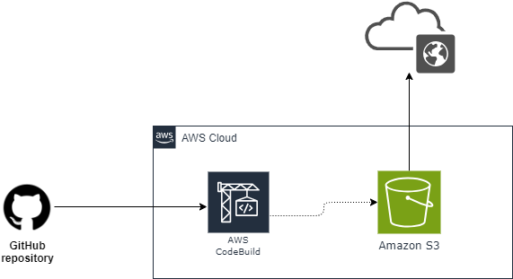

## AWS Continuous Deployment pipeline from GitHub to S3.
> This demo shows how to host your website code in GitHub, create a pipeline that will pull that code everytime you make a change and deploy it out to an S3 bucket.
## Stages
1. Source
> This is where the code will be committed.
2. Build and Test
> Use tools like AWS CodeBuild or Jenkins to build and test your code.
3. Deploy
> Deploy your code to S3 bucket

