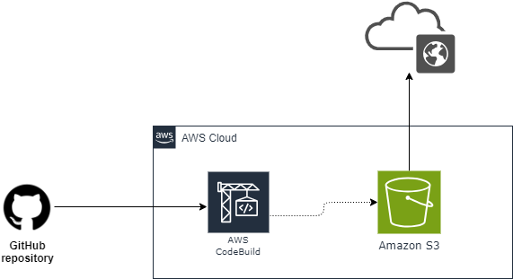

## AWS Continuous Deployment pipeline from GitHub to S3.
> This demo shows how to host your website code in GitHub, create a pipeline that will pull that code everytime you make a change and deploy it out to an S3 bucket.
## Stages
1. Source
> This is where the code will be committed.
2. Build and Test
> Use tools like AWS CodeBuild or Jenkins to build and test your code.
3. Deploy
> Deploy your code to S3 bucket

## Steps:
1. Create your Application and store in a GitHub reposiroty
2. Create your S3 bucket. `S3 bucket can be used to host static website`
- Enable public accessible bucket
- Add bucket policy to all everybody to read all files in a bucket.
- Enable static website hosting.
3. Setup Codepipeline 
> The pipeline will orchestrate getting the code from GitHub to the bucket.